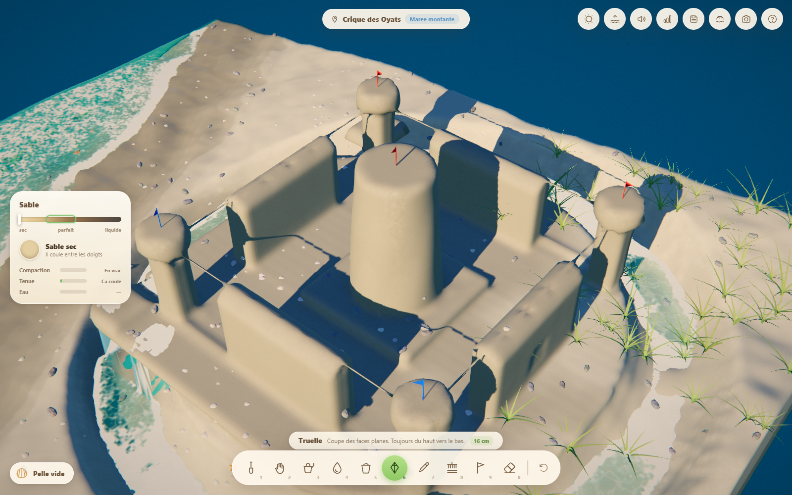
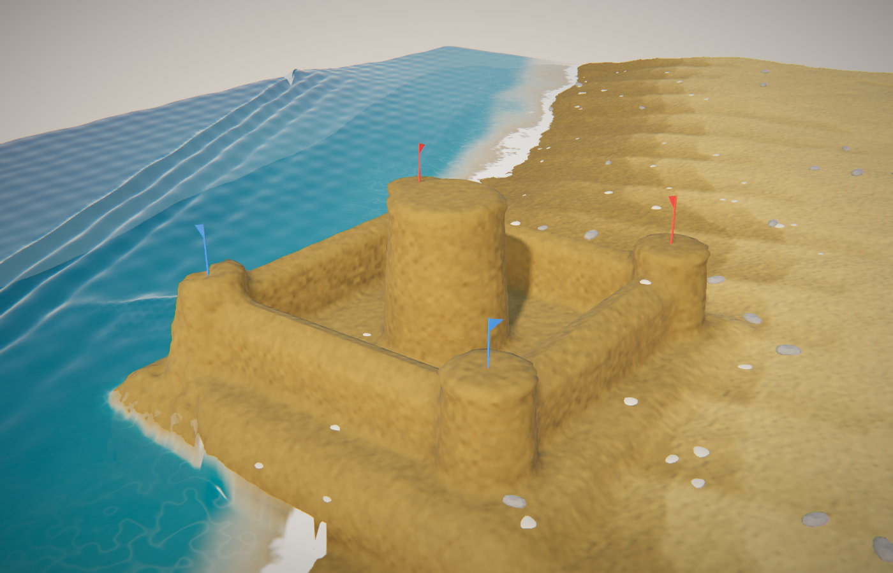

# Sandcastle

Un bac à sable 3D pour construire des châteaux de sable, dans le navigateur.
Pas de blocs à empiler, pas de pièces préfabriquées : **de la matière**. Le
sable coule, tient ou s'effondre selon son humidité et son tassement, l'eau
s'infiltre et ruisselle, la marée monte et finit par tout reprendre.





---

## Démarrer

```bash
npm install
npm run dev        # http://localhost:5173
```

`npm run build` produit un site statique dans `dist/`.

> Le serveur envoie les en-têtes COOP/COEP pour que `SharedArrayBuffer` soit
> disponible ; le jeu fonctionne sans, mais les workers de maillage copient
> alors leurs blocs au lieu de les partager.

---

## Ce qui est réellement simulé

Rien n'est scripté ni animé à la main. Tout ce que vous voyez sort de trois
solveurs qui tournent en continu sur un champ de voxels de 4 cm — une parcelle
de 12,8 m de côté, la mer sur toute une face et la plage qui lui fait face.

### Le sable

Le sable mouillé tient parce que l'eau forme des **ponts capillaires** entre
les grains : la tension de surface les tire les uns vers les autres et crée une
cohésion apparente. Quelques pourcents d'eau suffisent — c'est le régime
pendulaire. Quand les pores se remplissent, les ponts fusionnent, la succion
disparaît, et le sable se liquéfie.

L'angle de stabilité maximal en découle :

| Humidité | θ_max (bien tassé) | Ce que ça donne |
|---------:|-------------------:|-----------------|
| 0 %      | 34°                | Angle de repos pur frottement : ça coule, toujours |
| 2 %      | 60°                | Ça commence à tenir |
| 5 %      | 77°                | Bonne tenue |
| 10–30 %  | **85–87°**         | Murs quasi verticaux — la fenêtre des sculpteurs |
| 50 %     | 70°                | Lourd, mou |
| 80 %     | 36°                | S'affaisse sous son poids |
| 100 %    | 15°                | Liquéfié : coule comme une boue |

Le **tassement** compte autant que l'eau : damer multiplie les points de
contact entre grains. À humidité égale, du sable en vrac tient une pente à 73°,
du sable en pound-up tient 88°, et surtout il porte des surplombs.

Trois choses en découlent, et elles se vérifient dans le jeu :

- un **mur vertical** ne monte pas au-delà d'une hauteur critique (~90 cm en
  sable parfait, formule de Culmann) ;
- une **tour** suit `H_max ∝ R^(2/3)` : doubler la hauteur exige 2,83× le rayon ;
- un **surplomb** tient 12 à 16 cm, et il tient *mieux* quand il est chargé —
  la compression augmente la cohésion, comme dans les arches de grès.

Une rupture n'est jamais instantanée : la contrainte s'accumule pendant deux à
quatre secondes, le temps de voir venir.

### L'eau

- **Une nappe en eaux peu profondes** (Saint-Venant, conservative à la
  machine près) sur des cellules de 8 cm : le jet de rive, les douves, les
  canaux et les flaques sont une hauteur d'eau qui coule sur le sable et
  franchit ou non chaque mur. Au large, la mer est imposée (marée + houle),
  ce qui permet une mer aussi grande qu'on veut sans alourdir la physique.
- **Des gouttes** pour ce qui quitte la nappe : un seau versé, une lame qui
  bascule d'un rebord. Elles rendent leur volume exact à la nappe en se posant.
- **Nappe phréatique** liée à la marée. Creusez sous son niveau, le trou se
  remplit tout seul. C'est aussi du sable parfait gratuit : la frange
  capillaire garde 30 cm de sable humide au-dessus de la nappe.
- **Écume** née du cisaillement, des impacts et du déferlement, qui voyage avec
  l'eau puis se dépose en laisse sur le sable.
- **Ressac** : une oscillation imposée au large que le solveur propage en
  nappes qui montent et redescendent sur l'estran.
- **Érosion** hydraulique couplée à la cohésion : du sable bien tassé et humide
  résiste trente fois mieux à l'arrachement que du sable sec.
- **Infiltration** : l'eau de surface devient de l'humidité dans le sable, qui
  percole vers le bas, diffuse latéralement, et s'évapore au soleil.

### La marée

Cycle complet en douze minutes de jeu. Réglable, jusqu'à figée — un mode
sanctuaire pour ceux qui veulent juste sculpter tranquillement.

Le bouton **Mer et météo** (en haut à droite) choisit un temps — calme,
brise, houle, grosse houle, tempête — qui règle d'un coup les vagues, le vent,
le ciel et la pluie. Chaque jauge se retouche ensuite à la main : hauteur des
vagues (jusqu'à 80 cm, la limite étant l'eau qu'il y a sous elles), puissance (des vagues longues qui déferlent en plongeant et projettent
des embruns), agitation, et ce que la mer abîme, de « rien » à
« impitoyable ». Tout est sauvegardé avec la partie. Un mur de sable est étanche : la
nappe ne remplit que ce qu'elle atteint à travers du sable naturel, donc un
trou creusé au bord de l'eau se remplit, l'intérieur d'une enceinte reste sec.

---

## Prise en main

Vous creusez huit secondes après l'ouverture. Le reste s'apprend en jouant.

### Souris

| Geste | Effet |
|---|---|
| **Clic gauche** | Action principale de l'outil |
| **Clic droit** | Action inverse (déposer, lisser, reboucher…) |
| **Molette** | Zoom, centré sur le curseur |
| **Ctrl + molette** | Rayon de la brosse |
| **Clic molette** | Pivoter la caméra |
| **Maj + clic molette** | Déplacer la caméra (le point saisi reste sous le curseur ; Maj peut être pressé en cours de geste) |
| **Alt + clic gauche** | Pivoter (souris sans molette cliquable) |

La molette nue zoome vers le point survolé, comme partout ailleurs ; le
rayon de brosse est sur Ctrl + molette et sur `[` `]`.

### Clavier

| Touche | Effet |
|---|---|
| `1` … `0` | Outils |
| `Ctrl` (pendant un geste) | **Verrouille l'altitude** — pour creuser à fond plat ou araser un mur |
| `Maj` | Modificateur d'outil (coupe horizontale, écartement du râteau, variante de décor) |
| `[` `]` | Rayon de brosse |
| `Ctrl+Z` / `Ctrl+Maj+Z` | Annuler / refaire |
| `Ctrl+S` / `Ctrl+O` | Sauvegarder / recharger la plus récente |
| Bouton vague | Nouvelle plage : gabarit (classique, grande plage plate, lagon, crique, dunes, marée basse, plage pentue, banc de sable, récif barrière, pied de falaise), taille de la carte (6,4 à 20,5 m par côté, la page se recharge), profil personnalisable (début de la mer, profondeur, avant-plage, face, berme, dunes, anse, banc, récif, falaise) et graine, un mot suffit ; mêmes réglages et même graine redonnent la même plage |
| Bouton disquette | Sauvegardes et réglages : sauvegarde automatique (activable, choix conservé), historique des sauvegardes (10 automatiques, 20 manuelles, chacune rechargeable), et « l'eau n'emporte pas le sable » pour sculpter sans craindre la mer |
| `W A S D` / `Q E` | Caméra |
| `P` | Mode photo |
| `H` | Aide |
| `F3` | Diagnostics (temps par poste, solveur d'eau GPU ou CPU, mémoire partagée) |

Paramètres d'URL : `?map=416x224` fixe la taille de la carte en voxels de 4 cm (multiples de 32, de 160 à 512), `?gpuwater=0` force le solveur d'eau CPU (`?gpuwater=trace` journalise la validation GPU), `?msaa=0|2|4` fixe l'anti-crénelage, `?fresh=1` ignore la sauvegarde au démarrage.

### Les outils

| # | Outil | Clic gauche | Clic droit |
|---|---|---|---|
| 1 | **Pelle** | Creuse et remplit la pelle. Plus bas = plus humide | Vide la pelletée ici |
| 2 | **Main** | Lisse et arrondit : flou gaussien 3D, les marches deviennent des pentes (jauge d'intensité, ou Ctrl+Maj+molette) | Tasse (pound-up) |
| 3 | **Arrosoir** | Humidifie | Assèche |
| 4 | **Seau d'eau** | Verse un vrai volume | Éponge |
| V | **Seau de sable** | Verse du sable en vrac, sans limite : comble un trou, monte un tas (le seau se penche et le filet tombe de sa lèvre) | Reprend du sable |
| 5 | **Seau** | Maintenir pour remplir, relâcher pour démouler | — |
| 6 | **Truelle** | Coupe une face plane (Maj = horizontale) | Replâtre |
| 7 | **Mirette** | Creuse portes, fenêtres, arcs | Rebouche |
| 8 | **Râteau** | Grave des rainures (appareil de briques) | Efface |
| 9 | **Décoration** | Pose drapeaux, coquillages, oyats | Retire |
| 0 | **Gomme** | Efface largement | Comble en vrac |
| F | **Ouverture** | Porte ou fenêtre cintrée (plein cintre, ogive, surbaissée, droite) percée dans la paroi visée, contour affiché avant le clic | — |
| T | **Escalier** | Tire du pied vers le haut d'une pente : marches taillées et remblayées au relâchement, aperçu pendant le trait | — |
| U | **Gouge** | Rainure nette à profil en U ou en V le long du trait (tuiles, pierres, moulures) | Efface |
| X | **Paille** | Souffle les grains détachés et les miettes sans toucher à la forme | — |
| R | **Règle** | Deux clics : distance, à plat, dénivelé, pente | Efface |
| M | **Miroir** | Chaque geste est répété de l'autre côté du plan (Maj+M : autre axe) | — |
| B | **Construction** | Bloc, mur spline, **tour** (fruit, toit conique) ou **dôme**, avec aperçu | — |

### La méthode des sculpteurs

1. Creusez jusqu'au sable humide — la nappe n'est jamais loin.
2. Empilez, mouillez, **tassez** couche par couche. Le tassement est le geste
   qui compte : sans lui, rien ne monte.
3. Sculptez **toujours du haut vers le bas**. Ce n'est pas une règle du jeu,
   c'est une conséquence : ce qui tombe abîme ce qui est en dessous.
4. Une douve autour protège du ressac. Un jour ou l'autre, la marée gagnera.

---

## Tests

```bash
npm test          # mailleur + physique + invariants de l'eau (Node, sans navigateur)
npm run bench:water # budget CPU de l'eau (1,5 ms par pas de jeu)
npm run test:play # intégration complète : outils, annulation, sauvegarde
npm run test:trench # creuser une tranchée et y faire couler l'eau
npm run test:tide # la marée reprend le château, et la reprise de partie
npm run test:all  # tout (serveur de dev requis pour les deux derniers)

npm run castle    # construit un château par script et le photographie
npm run shot      # capture d'écran de l'état courant
```

Les tests ne vérifient pas que le code s'exécute : ils vérifient que **la
physique est juste**. Un tas de sable sec doit former un cône à 34°, un mur de
sable parfait doit tenir debout, le même mur en sable sec doit s'effondrer, un
surplomb de 3 voxels doit tenir et un de 12 doit céder, la masse doit être
conservée à l'octet près, et une plage laissée seule trois minutes ne doit pas
se faire raboter par le ressac.

Un test protège même une intention de **conception** : à pleine mer, la mer doit
submerger le milieu de plage (sinon la marée n'est qu'une décoration) tout en
laissant la berme au sec (sinon il n'existe aucun endroit sûr où bâtir).

Et l'eau a ses **invariants**, prouvés sans navigateur : le volume est
conservé à 1e-6 m³ près sur une minute, une mer d'huile reste plate au
millimètre, aucun pas de temps ne produit de hauteur négative, une enceinte
fermée reste sèche sous la houle, un seau versé en haut d'une rigole descend
jusqu'à la mer sans déborder, une lame de 2 mm se rend sans trou, une crête
avance à `sqrt(g h)`, l'écume reste une bande qui s'efface, la pleine mer
submerge le milieu de plage mais pas la berme, et un seau versé sur le plateau
se retrouve intégralement entre nappe, gouttes et sable.

---

## Structure

```
src/
  core/      Config (toutes les constantes physiques), boucle de jeu, sauvegarde
  sim/       VoxelField, Granular, Moisture, Water, SandPhysics
    meshing/ Surface Nets + pool de workers
  render/    Matériau du sable, eau, ciel, décor, post-traitement, caméra
  tools/     Brosses, catalogue d'outils, gestion des entrées, annulation
  ui/        Interface
  audio/     Synthèse procédurale (aucun fichier audio)
  world/     Génération de la plage, bruits
docs/        Recherche : bible des châteaux de sable, physique, rendu, game design
tools/       Tests et outils de capture
```

Aucun asset externe : géométries, textures, sons et icônes sont tous générés en
code.

Voir [`docs/ARCHITECTURE.md`](docs/ARCHITECTURE.md) pour les choix techniques,
et les quatre documents de recherche dans `docs/` pour le fond.

---

## Performances

Cibles sur une machine de bureau moyenne, en 1080p :

| Poste | Budget |
|---|---|
| Simulation (granulaire + humidité + eau) | ~4,5 ms par pas (eau : ~0,9 ms amorti, budget 1,5) |
| Maillage | 1 ms par chunk, 6 chunks par frame, sur 3 à 5 workers |
| Géométrie | ~310 k triangles au repos |
| Mémoire des champs voxel | ~50 Mo |
| Sauvegarde | ~480 Ko compressés |

Le budget de simulation s'adapte tout seul : sous 40 images par seconde, le
sable coule un peu plus lentement plutôt que de faire saccader le jeu.
